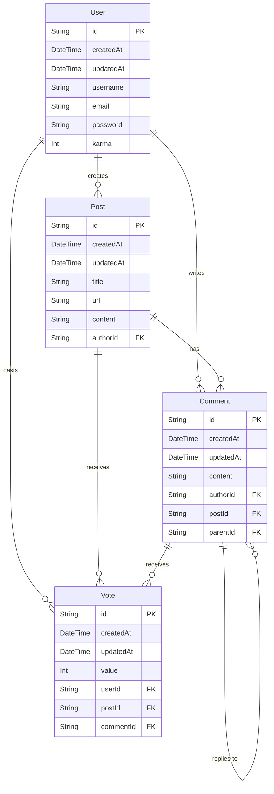

# Prisma Hacker News App

## Setup

## Database structure
The database schema consists of four main models:

- User: Represents registered users who can create posts, comments, and votes.
- Post: Represents submitted stories or links, created by users.
- Comment: Represents user comments on posts or replies to other comments.
- Vote: Represents upvotes or downvotes cast by users on posts or comments.

