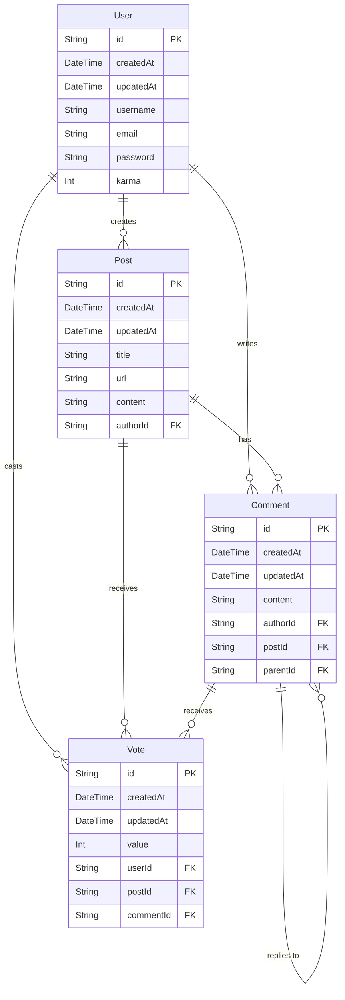

# Prisma Hacker News App
Hacker News clone demonstrating how to build with Prisma in a real-world application.

## Getting started
1. Clone the repository:
    ```bash
    git clone git@github.com:luanvdw/prisma-hackernews-app.git &&
    cd prisma-hackernews-app
    ```
2. Install dependencies:
    ```bash
    npm install
    ```
3. Set up your environment variables:
    ```bash
    cp .env.example .env
    ```
    Add your DATABASE_URL && DATABASE_URL_DIRECT in the  `.env` file.

4. Set up the database and run migrations:
    ```bash
    npx prisma migrate dev
    ```
5. Seed the database:
    ```bash
    npx prisma db seed
    ```

## Running a benchmark
This repository includes a benchmark script that simulates an environment to evaluate database performance with Prisma Accelerate. The script is designed to:
- Simulate multiple concurrent serverless function invocations by spawning separate Node.js processes.
- Measure the performance of database queries under high concurrency.
- Evaluate the effectiveness of connection pooling in a serverless-like context.
- Evaluate the effectiveness of Prisma Accelerate in globally distributed applications.

```bash
npm run benchmark
```

## Database structure
The database schema consists of four main models:

- User: Represents registered users who can create posts, comments, and votes.
- Post: Represents submitted stories or links, created by users.
- Comment: Represents user comments on posts or replies to other comments.
- Vote: Represents upvotes or downvotes cast by users on posts or comments.

