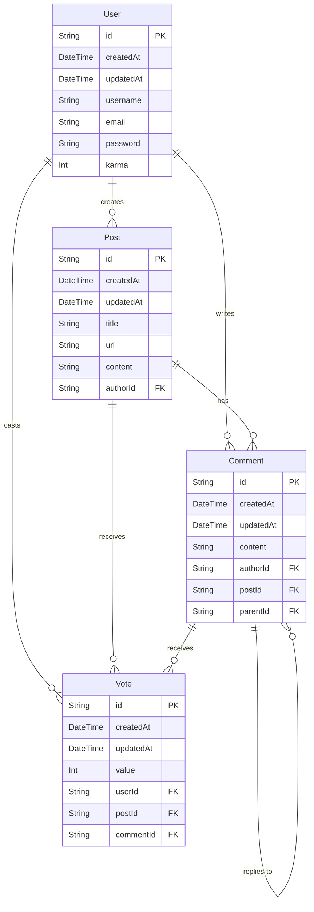

# Prisma Hacker News App
Hacker News clone demonstrating how to build with Prisma in a real-world application.

## Getting started
1. Clone the repository:
    ```bash
    git clone git@github.com:luanvdw/prisma-hackernews-app.git &&
    cd prisma-hackernews-app
    ```
2. Install dependencies:
    ```bash
    npm install
    ```
3. Set up your environment variables:
    ```bash
    cp .env.example .env
    ```
    Add your DATABASE_URL && DATABASE_URL_DIRECT in the  `.env` file.

4. Set up the database and run migrations:
    ```bash
    npx prisma migrate dev
    ```
5. Seed the database:
    ```bash
    npx prisma db seed
    ```


## Benchmarking
This repository includes two benchmark scripts designed to evaluate different aspects of Prisma Accelerate's performance:

1. Distributed Benchmark: Simulates a distributed environment to evaluate database performance with Accelerate.
2. Cache Benchmark: Load tests Accelerate's caching functionality.

### 1. Distributed Benchmark
This benchmark script simulates an environment to evaluate database performance with Prisma Accelerate in a distributed setting. The script is designed to:

- Simulate multiple concurrent serverless function invocations by spawning separate Node.js processes.
- Measure the performance of database queries under high concurrency.
- Evaluate the effectiveness of connection pooling in a serverless-like context.
- Evaluate the effectiveness of Prisma Accelerate in globally distributed applications.

To run the distributed benchmark:

```bash
npm run benchmark:distributed
```

### 2. Cache Benchmark
This benchmark script focuses on load testing Prisma Accelerate's caching functionality. It is designed to:

- Simulate a high number of concurrent requests to test cache performance.
- Measure response times for cached and non-cached queries.
- Evaluate the effectiveness of Accelerate's caching strategy.
- Provide insights into cache hit rates and performance improvements.

To run the cache benchmark:
```bash
npm run benchmark:cache
```

### Interpreting Results
Both benchmarks will output detailed performance metrics, including:

Average response times
Median, 95th percentile, and 99th percentile response times
Cache hit rates (for the cache benchmark)
Total execution time

These metrics will help you understand the performance characteristics of Prisma Accelerate in different scenarios and optimize your database interactions accordingly.

## Leveraging Cache Invalidation 🆕
Accelerate's cache invalidation works by allowing you to tag cached queries and then selectively invalidate those tags when needed.

Here's how it functions:
1. Tagging: When caching a query, you can add one or more tags to it.
```ts
await prisma.post.findMany({
  cacheStrategy: { ttl: 300, tags: ["posts"] },
})
```
2. Caching: Accelerate stores the query results in its global cache, associated with these tags.
```ts
await prisma.$accelerate.invalidate({
  tags: ["posts"],
})
```
3. Invalidation: When data changes, you can invalidate specific tags using the invalidation API.
4. Result: All cached queries with the invalidated tags are removed from the cache, ensuring fresh data on the next query.

This system provides a flexible way to maintain cache freshness without having to invalidate the entire cache, balancing performance gains from caching with data accuracy needs.

*Note that Accelerate's cache invalidation is currently experimental and may change in the future.

## Database structure
The database schema consists of four main models:

- User: Represents registered users who can create posts, comments, and votes.
- Post: Represents submitted stories or links, created by users.
- Comment: Represents user comments on posts or replies to other comments.
- Vote: Represents upvotes or downvotes cast by users on posts or comments.

